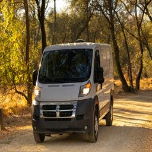
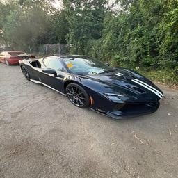
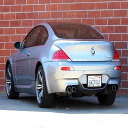
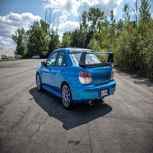
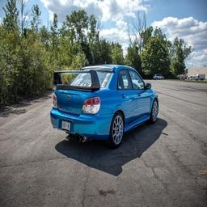

# Vehicle Orientation Classification System

This repository contains the implementation of a deep learning model for **vehicle orientation classification** using TensorFlow and Keras.

## Repository Structure

```
├── Datasets
│   ├── train
│   │   ├── front
│   │   ├── front-left
│   │   ├── front-right
│   │   ├── rear
│   │   ├── rear-left
│   │   ├── rear-right
│   │   └── high-angle-view
│   └── test
│       ├── AutoTest
│       │   ├── front
│       │   ├── front-left
│       │   ├── front-right
│       │   ├── rear
│       │   ├── rear-left
│       │   ├── rear-right
│       │   └── high-angle-view
│       └── ManualTest
│
├── Sample Output.csv
├── Vehicle_Orientation_Classification_System.ipynb
├── Vehicle_Orientation_Classification_System_Report.docx
├── requirements.txt
└── vehicle_orientation_model.keras
```

## Features
- Vehicle orientation classification using **ResNet50** with fine-tuning  
- Data augmentation and preprocessing pipeline  
- Class balancing with `compute_class_weight`  
- Training & fine-tuning with **callbacks** (EarlyStopping, ReduceLROnPlateau, ModelCheckpoint)  
- Evaluation on both **AutoTest** and **ManualTest** sets

## Review Datasets
### Front
<p align="center">
  
  
  
</p>

### Front-left
<p align="center">
  
  
  
</p>

### Front-right
<p align="center">
  
  
  
</p>

### Rear
<p align="center">
  
  
  
</p>

### Rear-left
<p align="center">
  
  
  
</p>

### Rear-right
<p align="center">
  
  
  
</p>

### High-angle-view
<p align="center">
  
  
  
</p>

## Installation

```bash
pip install -r requirements.txt
```

## Usage

1. Train the model:
   ```bash
   jupyter notebook Vehicle_Orientation_Classification_System.ipynb
   ```
2. Evaluate on test datasets (`AutoTest`, `ManualTest`).
3. Check the results in `Sample Output.csv`.

## Requirements
- Python 3.12.11
- TensorFlow 2.19.0
- OpenCV 4.12.0
- NumPy 2.0.2
- Pandas 2.2.2
- Scikit-learn 1.6.1
- Matplotlib 3.10.0
- Seaborn 0.13.2

## Report
Detailed documentation can be found in **Vehicle_Orientation_Classification_System_Report.docx**.

---

Developed for academic and research purposes by Pham Phuoc Minh Hieu.
